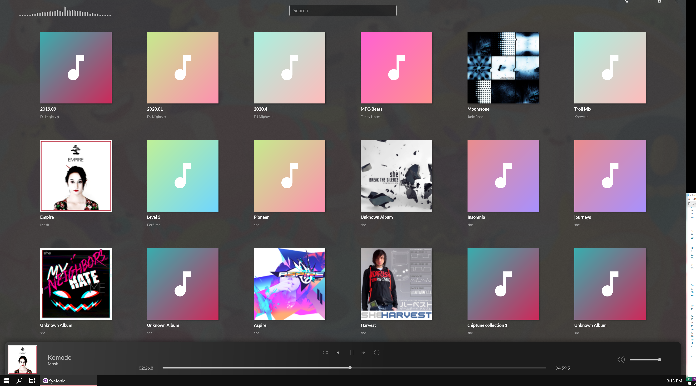
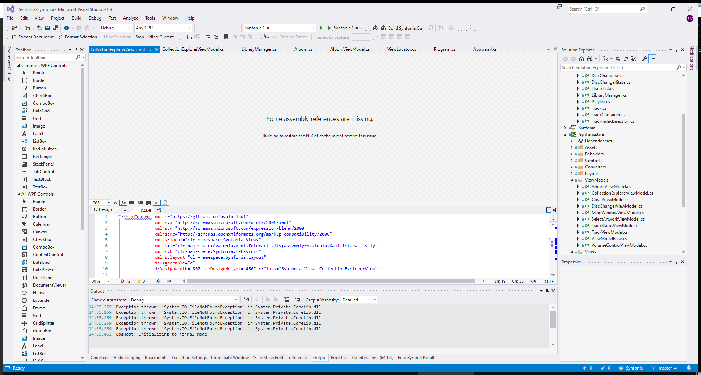

Follows are my impressions of my re-evaluation of Avalonia in September 2020. I last seriously tried Avalonia in September of 2018 so I thought now was a good time to check up on what's going on. I'm writing this document partially for my own sake and partially because I thought [Jumar](https://twitter.com/jumarmacato) might find the rambly feedback useful after he convinced me to give Avalonia another try sooner rather than later.

I do not remember many specifics my experience in 2018. I do know I prototyped a small app I was working on with Avalonia but I ultimately decided Avalonia needed more time in the oven.

A few things you might want to know about me to understand why I went about evaluating Avalonia the way I did:

* I generally expect things to open+build without installing anything, including Visual Studio extensions.
* If they don't build I expect them to fail gracefully.
* I'm kinda picky about UI frameworks handling UI quirks and edge-cases as expected. (Some common broken examples being Ctrl+Backspace for word deletion or multi-DPI setups, both of which Avalonia handles mostly correctly!)
  * (My philosophy here is that while some people consider quirks like these to be edge cases, other people make them part of their workflow habits and violating them in a singular app is very distracting.)
* I'd rather an app crash than behave erroneously. (This goes double for developer tools.)
* For UI stuff, I have much more experience with Win32, Winforms, Dear ImGui, and web stuff than I do WPF (or Avalonia, obviously.) As such I won't be looking at Avalonia through the lens of a WPF developer, since I am not a WPF developer.

Obviously I'm just one developer and the things I care about might not necessarily matter to Avalonia or your target audience as a whole. This document is purely from my perspective discussing things that I think about when I'm evaluating a framework like Avalonia.

Some very vauge and possibly untrue negative vibes I remember from 2018:

* Avalonia's dev tools were unstable. (I remember the XAML preview crashing a lot.)
* Avalonia's dev tools interfered with non-Avalonia projects. (This might be false, but it's kicking around in my head.)
* Avalonia was laggy. (For some reason I remember the calendar control in particular locked up the controls demo.)
* Avalonia didn't handle UI quirks like I expected it to.
* I was disappointed there wasn't built-in support for tearable-tabs and window docking. (Either web browser or Visual Studio-style.)

(Obviously I'm gonna remember the reasons I decided *not* to use Avalonia more than reasons I liked it. Even back then Avalonia was a very impressive project that I wanted to see succeed in the long run.)

I will try to use emojis to highlight specific types of feedback throughout this impressions journal:

| | |
|----|----|
| 🤔 | Suggestion for a possible way to improve something that bothered me |
| 🎉 | Something worth celebrating |
| 🐛 | A bug I found |
| 💥 | A crash bug I found |
| 😕 | Something that isn't/might not be a bug but I wasn't a fan of the behavior |
| 🤡 | Something I wasn't a fan of, but I'll admit it's pedantic |
| 📋 | I reported this issue. (Emoji will be a link to the issue) |
| 🥺 | A feature I really want but I know you have bigger fish to fry |

Sometimes I'm giving commentary on the actual examples (like Synfonia) rather than Avalonia: IMO it's important to get these things right because they're the first way a lot of people interact with Avalonia in order to evaluate it.

My notes here are largely in the order that I discovered the issue, but sometimes I add notes to earlier sections to make this document more readable.

# The Avalonia Website

* 🤡 `avaloniaui.net` does not automatically redirect HTTP to HTTPs.
* 🤡 `reference.avaloniaui.net` doesn't even support HTTPs.
* 🐛 The "Find out more" button under the XAML heading is a broken link to http://avaloniaui.net/docs/quickstart/xaml
* 😕 The "Get support" button on https://avaloniaui.net/support just links to the same page.
* 🤔 The Avalonia website should provide an easy-to-find pre-built download of [the controls gallery](https://github.com/AvaloniaUI/XamlControlsGallery). (I had to go find it and build it myself.)
  * The controls gallery is a quick-and-easy way for someone to quickly evaluate if Avalonia supports their needs out of the box.
  * Being able to interact with the controls gives more confidence that they work as you expect. (It's much easier to make something that's visually pretty than to make something that's pleasant to interact with. Right now I feel like Avalonia is trying to hide the interaction aspect from me.)
* 🎉 I was glad to see the featured products section at the bottom. It drives me up the wall when visually-oriented libraries never show anything visual. (That being said, I do wish there was a page dedicated to full-resolution screenshots on various platforms.)
* `DatePicker` is not documented at http://avaloniaui.net/docs/controls/

# Building Synfonia

First thing I did was clone Synfonia. I wanted to try building it without downloading the Avalonia VS integration.

## Extremely Lengthy Restore

Upon first attempt to build, I thought something was broken because it seemed like the build was stuck. Upon trying to build with `dotnet build --verbosity normal` I realized it was taking absolute ages to restore packages.

Looking at the logs, it seems like this is happening because NuGet has to absolutely hammer the API on nuget.avalonia.net to find the package versions it cares about because it has to wade through countless CI builds.

I'm no expert on the inner workings of the NuGet API, but I believe this is one of the things that got way better with v3 of the NuGet API. Although it may just be due to the floating versions used in Synfonia.

🤔 This might also be something that could be improved by using something beefier than a self-hosted Nexus server. (Maybe switch to Azure DevOps? It seems to handle the daily builds of Roslyn just fine. It's NuGet v3 too.)

🤔 Maybe consider having the default branch of Synfonia be pinned to the last stable release of Avalonia for a better out of the box experience.

🤔 If the above don't solve the problem, consider adding a custom target to projects like Synfonia that runs before the `Restore` target that prints a message warning the user the restore might take a long time at first.

Edit: I realized in retrospect that Visual Studio probably should've shown the Package Manager output log before I even started the build. I'm not really sure why it didn't, but I think my comments about improving the speed of restore still hold. You can see from this random smattering of API requests that the Avalonia NuGet server is just plain slow:

```
  OK https://nuget.avaloniaui.net/repository/avalonia-all/FindPackagesById()?$skip=640&id=%27Avalonia.FreeDesktop%27&semVerLevel=2.0.0 6332ms
  GET https://nuget.avaloniaui.net/repository/avalonia-all/FindPackagesById()?$skip=720&id=%27Avalonia.Win32%27&semVerLevel=2.0.0
  GET https://nuget.avaloniaui.net/repository/avalonia-all/FindPackagesById()?$skip=680&id=%27Avalonia.FreeDesktop%27&semVerLevel=2.0.0
  OK https://nuget.avaloniaui.net/repository/avalonia-all/FindPackagesById()?$skip=600&id=%27Avalonia.Native%27&semVerLevel=2.0.0 5062ms
  GET https://nuget.avaloniaui.net/repository/avalonia-all/FindPackagesById()?$skip=640&id=%27Avalonia.Native%27&semVerLevel=2.0.0
  OK https://nuget.avaloniaui.net/repository/avalonia-all/FindPackagesById()?$skip=600&id=%27Avalonia.ReactiveUI%27&semVerLevel=2.0.0 6345ms
  GET https://nuget.avaloniaui.net/repository/avalonia-all/FindPackagesById()?$skip=640&id=%27Avalonia.ReactiveUI%27&semVerLevel=2.0.0
  OK https://nuget.avaloniaui.net/repository/avalonia-all/FindPackagesById()?$skip=600&id=%27Avalonia.Skia%27&semVerLevel=2.0.0 5101ms
  GET https://nuget.avaloniaui.net/repository/avalonia-all/FindPackagesById()?$skip=640&id=%27Avalonia.Skia%27&semVerLevel=2.0.0
  OK https://nuget.avaloniaui.net/repository/avalonia-all/FindPackagesById()?$skip=560&id=%27Avalonia.Remote.Protocol%27&semVerLevel=2.0.0 6438ms
  GET https://nuget.avaloniaui.net/repository/avalonia-all/FindPackagesById()?$skip=600&id=%27Avalonia.Remote.Protocol%27&semVerLevel=2.0.0
  OK https://nuget.avaloniaui.net/repository/avalonia-all/FindPackagesById()?$skip=720&id=%27Avalonia.Diagnostics%27&semVerLevel=2.0.0 5381ms
  OK https://nuget.avaloniaui.net/repository/avalonia-all/FindPackagesById()?$skip=560&id=%27Avalonia.Controls.DataGrid%27&semVerLevel=2.0.0 6548ms
  GET https://nuget.avaloniaui.net/repository/avalonia-all/FindPackagesById()?$skip=760&id=%27Avalonia.Diagnostics%27&semVerLevel=2.0.0
  ```

  5-6 seconds per API request might not seem like it's *that* bad until you count and realize that NuGet had to hit the Avalonia NuGet API for 752 separate requests. (If you broke out the calculator you might realize that would total over an hour. While it took too long to restore, it didn't take over an hour. I assume a lot of those requests are happening concurrently or not all 752 of them are that slow.)

  The [controls gallery](https://github.com/AvaloniaUI/XamlControlsGallery) also had this lengthy restore issue so I don't think it's an issue isolated to Synfonia.

## Missing `Microsoft.DesktopBridge.props`

After the lengthy restore completed, I got this error:

```
C:\Scratch\Synfonia\Synfonia\Synfonia.wapproj(51,3): error MSB4019: The imported project "C:\Program Files\dotnet\sdk\5.0.100-rc.1.20452.10\Microsoft\DesktopBridge\Microsoft.DesktopBridge.props" was not found. Confirm that the expression in the Import declaration "C:\Program Files\dotnet\sdk\5.0.100-rc.1.20452.10\\Microsoft\DesktopBridge\\Microsoft.DesktopBridge.props" is correct, and that the file exists on disk.
```

I'm assuming this is more just wapproj doesn't work with the dotnet CLI, but I thought I'd mention it in case that's not expected. (The modern Windows app stuff is not something I have a lot of experience in, so I don't know if this is surprising or not.)

## It launches!

After opening the solution in Visual Studio again and waiting for restore to do *things* it launched! (This is starting to make me blame restore for a lack of feedback, but I've never seen it this bad either.)

Unfortunately the app is blank. ~~Based on the submodules I'm assuming it would show my iTunes library by default, problem is I don't have iTunes installed. Poking around in the code suggests it can scan my music directory and there should be a button for it, but I don't see one so at this point I decided to install the Avalonia extension so I could browse the XAML faster.~~  While writing the previous paragraph through the power of reading comprehension I realized it was a context menu button and now I have music!

Double-clicking an album to play it seems a bit antiquated for a UI that looks like this.

F12 menu is cool. 🤔 Would be nice if zero-width/height controls would still get highlighted with an outline or something. (For example: There's a random `TextBlock` that's a sibling to the `DockPanel` that contains the seek slider and timestamps. It has a height of 0 so when you hover it nothing is highlighted on the UI.)

🤔 I wish the DevTools provided some information about the version of Avalonia I was using. (Particularly the Git commit hash so I can provide it in bug reports.)

[📋](https://github.com/AvaloniaUI/Avalonia/issues/4751)🐛 The DevTools window doesn't keep track of what monitor it's on properly.

🎉 The app scales as expected when dragged to monitor with a higher (200%) DPI (🥳)

[📋](https://github.com/AvaloniaUI/Avalonia/issues/4752)🐛 But when I maximized the window the window decorations were decapitated (😱)



[📋](https://github.com/AvaloniaUI/Avalonia/issues/4753)🐛 I also noticed after taking the previous screenshot that the blurred background portion of the window is leaking into the monitor to the right of this one when the window is maximized.

They remain (slightly) decapitated even after I restore the window: (Even on the 100% DPI monitors)


Maximizing and restoring on a 100% DPI monitor fixes it.

[📋](https://github.com/jmacato/Synfonia/issues/20)🐛 Also for some reason I can't play other music now. (Double click and right click > play both do nothing.) Was able to reproduce this: No matter what once I start playing an album I can't change the selection from the collection explorer. (Track skip buttons still work.)

🎉 Ctrl+Backspace works in the text entry!

[📋](https://github.com/AvaloniaUI/Avalonia/issues/4754)💥 Entering emojis (with Win+.) causes an `AccessViolationException` 😭 ([I see emojis are still pending support in Avalonia](https://github.com/AvaloniaUI/Avalonia/issues/1817), but I'd expect either uncolored emoji or an unknown character box, not a crash.) Here's the call stack from Visual Studio:

```
 	libSkiaSharp.dll!00007ffeb9e54900()	Unknown
 	libSkiaSharp.dll!00007ffeb9ca8b1f()	Unknown
 	libSkiaSharp.dll!00007ffeb9bdc023()	Unknown
 	[Managed to Native Transition]	
 	SkiaSharp.dll!SkiaSharp.SKFont.MeasureText(void* text, int length, SkiaSharp.SKTextEncoding encoding, SkiaSharp.SKRect* bounds, SkiaSharp.SKPaint paint)	Unknown
 	SkiaSharp.dll!SkiaSharp.SKFont.MeasureText(System.ReadOnlySpan<char> text, SkiaSharp.SKPaint paint)	Unknown
 	SkiaSharp.dll!SkiaSharp.SKFont.MeasureText(string text, SkiaSharp.SKPaint paint)	Unknown
 	SkiaSharp.dll!SkiaSharp.SKPaint.MeasureText(string text)	Unknown
 	Avalonia.Skia.dll!Avalonia.Skia.FormattedTextImpl.BuildRects()	Unknown
 	Avalonia.Skia.dll!Avalonia.Skia.FormattedTextImpl.GetRects()	Unknown
 	Avalonia.Skia.dll!Avalonia.Skia.FormattedTextImpl.HitTestTextPosition(int index)	Unknown
 	Avalonia.Visuals.dll!Avalonia.Media.FormattedText.HitTestTextPosition(int index)	Unknown
 	Avalonia.Controls.dll!Avalonia.Controls.Presenters.TextPresenter.CaretIndexChanged.AnonymousMethod__0()	Unknown
 	Avalonia.Base.dll!Avalonia.Threading.JobRunner.Job.Avalonia.Threading.JobRunner.IJob.Run()	Unknown
 	Avalonia.Base.dll!Avalonia.Threading.JobRunner.RunJobs(Avalonia.Threading.DispatcherPriority? priority)	Unknown
 	Avalonia.Win32.dll!Avalonia.Win32.Win32Platform.WndProc(System.IntPtr hWnd, uint msg, System.IntPtr wParam, System.IntPtr lParam)	Unknown
 	[Native to Managed Transition]	
 	user32.dll!00007fff347be858()	Unknown
 	user32.dll!00007fff347be299()	Unknown
 	[Managed to Native Transition]	
 	Avalonia.Win32.dll!Avalonia.Win32.Win32Platform.RunLoop(System.Threading.CancellationToken cancellationToken)	Unknown
 	Avalonia.Base.dll!Avalonia.Threading.Dispatcher.MainLoop(System.Threading.CancellationToken cancellationToken)	Unknown
 	Avalonia.Controls.dll!Avalonia.Controls.ApplicationLifetimes.ClassicDesktopStyleApplicationLifetime.Start(string[] args)	Unknown
 	Avalonia.Controls.dll!Avalonia.ClassicDesktopStyleApplicationLifetimeExtensions.StartWithClassicDesktopLifetime<Avalonia.AppBuilder>(Avalonia.AppBuilder builder, string[] args, Avalonia.Controls.ShutdownMode shutdownMode)	Unknown
>	Synfonia.Gui.dll!Synfonia.Program.Main(string[] args) Line 13	C#
```

Pasting emojis causes the same crash, so between that and the stack trash I'm inclined to believe it's not IME-related.

🐛 On that note, before the crash I noticed Avalonia doesn't seem to play nice with IMEs. This seems to be covered by https://github.com/AvaloniaUI/Avalonia/issues/2076 though. I also noticed the Japanese text I entered to test this was not rendered successfully (日本語 became ���) and ~~text selection with these broken characters was erratic.~~ ~~Text selection with 4 or less characters is erratic.~~Text selection when the mouse starts at the start of the textbox is erratic. (Put the text cursor at the end of the characters. Click and drag from the start of the symbols. Text selection goes between mouse cursor and text cursor rather than click start and mouse cursor. ~~Oddly enough this doesn't repro with longer strings, but I can consistently cause it with 日本語.~~ For whatever reason it's much easier to cause with strings of 4 or less characters. Bug works differently in XamlControlsGallery.)

After closing the app, for some reason Visual Studio decided to show the XAML file I had previously opened with the normal WPF editor:



No idea if there's anything Avalonia can do about this, but I can see it being confusing to some people. (Remember I don't have any Avalonia extensions installed yet.)

# The Control Gallery

I'll come back to Synfonia soon, but at this point I wanted to tinker with the control gallery.

🤔 The blank pages are a bad look. (At the very least they should be replaced by a page explaining what controls should be here but they aren't included in the demo yet.)

[📋](https://github.com/AvaloniaUI/Avalonia/issues/4755)🐛 The previously mentioned emoji crash doesn't cause a crash here, but it does cause some...strange behavior.

(My notes are getting a little sparser here because I made the decision to start filing issues on the Avalonia repo.)

[📋](https://github.com/AvaloniaUI/Avalonia/issues/4757)🐛 The `DatePicker` example with a custom day string and no year is kinda broken. (After looking at it a bit I realized it seems to be interpreting the `DayFormat` property as a `DateTime` string instead of whatever that special (XAML?) format is. -- Edit: [According to amwx](https://github.com/AvaloniaUI/Avalonia/issues/4757#issuecomment-699715958), this is a copy+paste error. (Still gives the impression Avalonia is buggy regardless.)

[📋](https://github.com/AvaloniaUI/Avalonia/issues/4758)🐛 The scroll position is shared between different tabs in the sample

[📋](https://github.com/AvaloniaUI/Avalonia/issues/4759)🐛 Scrolling down all the way in one tab and then siwtching to one which doesn't require scrolling results in a blank page.

🐛 This is more of a missing feature than a bug. While scrolling with the mouse wheel, Avalonia scrolls the panel underneath the mouse (🥳) but if the panel underneath the mouse doesn't need scrolling, the scroll doesn't propagate to the parent control (which might need scrolling.) This is inconsistent with what I'd expect. (To reproduce this in the control gallery, go to the Layout tab. Scroll down to the "An ItemsRepeater control using vertical StackLayout." Hover your mouse on the title and scroll up: It scrolls up. Hover your mouse on the red `0` square: It does not scroll up.)

[📋](https://github.com/AvaloniaUI/XamlControlsGallery/issues/4)💥 The Media sample explodes when you interact with it.

~~🎉 The XamlControlsGallery survived my graphics drivers being updated~~

[📋](https://github.com/AvaloniaUI/Avalonia/issues/4128#issuecomment-699719121)💥 Orrrr not...I tried to interact with it and it went bang.

With that, I don't think there's anything left in the XamlControlsGallery. Time to move on to...

# Visual Studio Extension Time

I installed Avalonia for Visual Studio (0.9.11.0) from the Visual Studio Marketplace via the Visual Studio extension manager.

🐛 At random points while I was editing the XAML and preview stopped updating. What it seemed like was invalid XAML would break the preview process and it'd stop updating even after I fixed it. Changing stuff back and forth seems to coax it back to life. Unfortunately it's really inconsitent.

🎉 One thing worth celebrating though is the designer never totally broke for me like I remember from two years ago. It got stuck occasionally, but it'd come back to life.

😕 It seems to me like I shouldn't actually be able to interact with the preview, but I can...(but only sometimes?) (It seems like I can interact with certain controls -- like the `ListBox` -- but only once.) IIRC, doesn't the WPF XAML editor let you click on controls to jump to their corresponding XAML?

🥺 Something that always annoyed me about the WPF XAML editor was that the previewer and the code editor were part of the same window pane, which means you can't really (easily) put the UI preview on one monitor and the code on another. Maybe Visual Studio strictions make this annoying to implement, but I'd love it if Avalonia was better in this department. (This is especially painful in Avalonia since it doesn't seem to let me scroll the preview.)

# Closing (for now)

I've been at this for about 6.5 hours now, so I think I'm gonna call it here. Hopefully you appreciate all the issues I filed and hopefully this rambling of a document is somehow useful.

## Random thoughts on Avalonia IDEs

I saw [Avalonia.Ide](https://github.com/kekekeks/Avalonia.Ide) mentioned in [#2212](https://github.com/AvaloniaUI/Avalonia/issues/2212). It's presented in that issue as (potentially?) a viable tool making Avalonia apps. This concerns me for a few reasons:

* If getting all the little fiddly UI quirks right in a UI is hard, an IDE is easily 3000x worse
* It makes me worry things are beind spread too thin
* One of my biggest qualms with Qt was always Qt Creator, and well... (Feels like I'm being asked to invest into a whole ecosystem when all I wanted as a UI framework.)
* The lack of a license and readme on this project is somewhat disconcerning (Synfonia should have a license too, BTW. Less important for it being a demo app, but it bothered me it didn't have one.)

Speaking of licenses, [AvalonStudio's is weird too](https://github.com/VitalElement/AvalonStudio/blob/develop/LICENSE.md). I get the desire here, but whacky licenses like this completely put off a lot of companies and developers like me from touching the project with a 30 ft pole. (From my perspective, this is just "GPL Lite but it wasn't written by lawyers".) I'm self-employed now, but at my previous employer we were basically forbidden from using anything besides MIT, BSD, and Apache-licensed stuff. (And I feel like the typical corporate developer type of person that'd be interested in Avalonia as a replacement for WPF would feel the same way or be in a similar situation.)

Finally back to the point of IDEs: It seems weird to me that two of the core maintainers of Avalonia are maintaining their own Avalonia IDEs. (Although it's hard to judge Nikita's at a glance without screenshots or anything. Maybe I've gotten the wrong impression and it's more of a glorified Avalonia testbed.)

I realize Avalonia needs a cross-platform UI designer solution given that it's a cross-platform UI framework, but I think it'd be better served by something integrated with VS Code if that's the main motivation for making your own IDE.

# Later on

Some other things I still want to do at some point:

* Follow the Getting Started tutorial on the Avalonia website
* Investigate how the spectrum thiny works in Synfonia
* Mess with the Avalonia version of MSBuild Log Viewer
* Maybe mess with WalletWasbi (and try to forget about my lost Bitboin wallet.)
* Maybe tinker with AvalonStudio and/or Avalonia.Ide just to see other apps made in it
* Prototype the tool I might want to make for [Biohazrd](https://github.com/InfectedLibraries/Biohazrd)???
